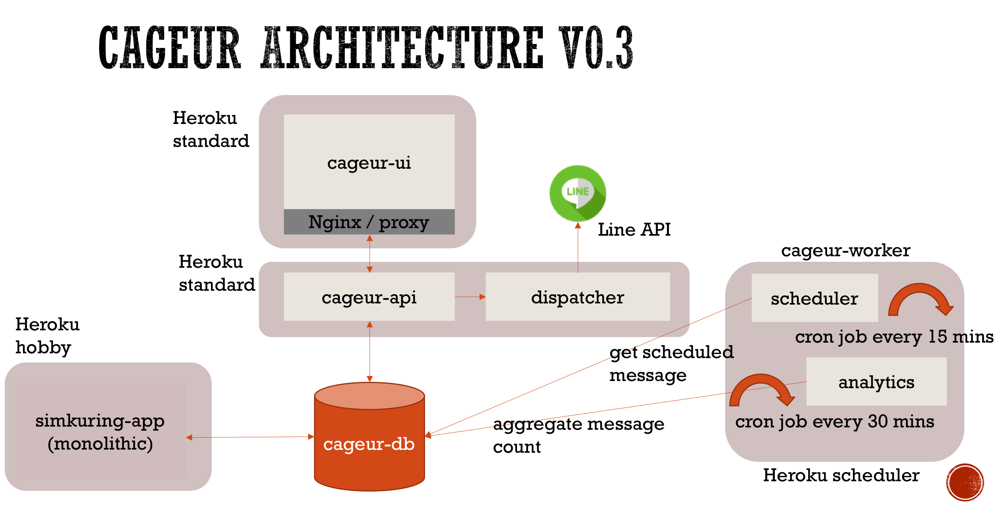

# Cageur  
[](https://travis-ci.com/girikuncoro/cageur)  
Cageur codebase. We aim to be the largest intelligent healthcare system in Indonesia by 2019.



## Requirement
* [docker-engine](https://docs.docker.com/engine/installation/)
* [docker-compose](https://docs.docker.com/compose/install/)

## Development
Using DB for development. You can connect psql client via docker or your own local psql
```
# running postgres db only with docker
docker-compose -f docker-compose.db.yml build
docker-compose -f docker-compose.db.yml up

# connect psql client from docker
docker run -it --rm --network=cageur_default --link cageur_db:postgres postgres psql -h postgres -U cageur_user -d cageur_db
```

## Deployment
```
docker-compose build
docker-compose up
```
Open up browser and navigate to `localhost:5000`, verify `Hello world from Cageur!` message displayed on the page.
